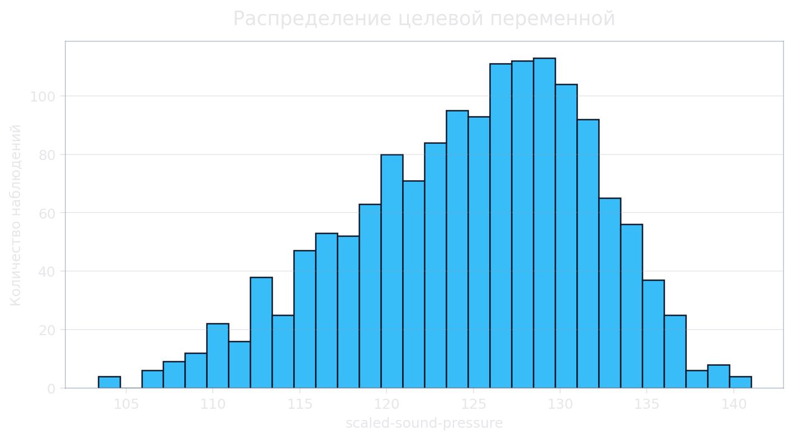
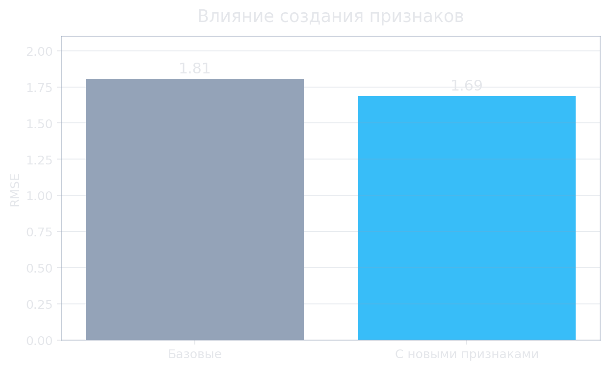
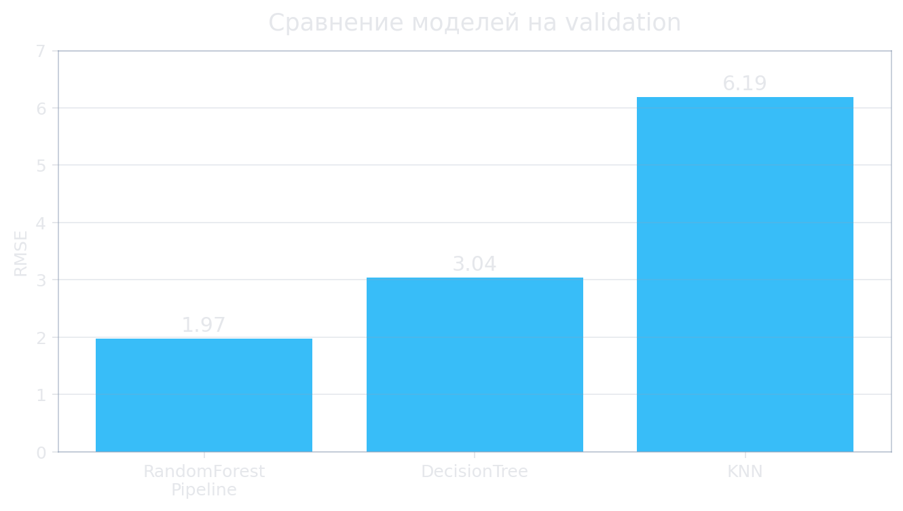
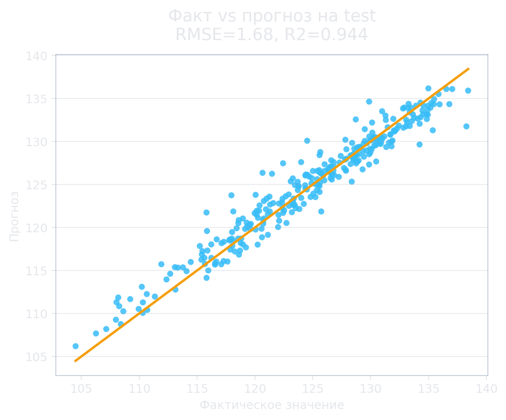
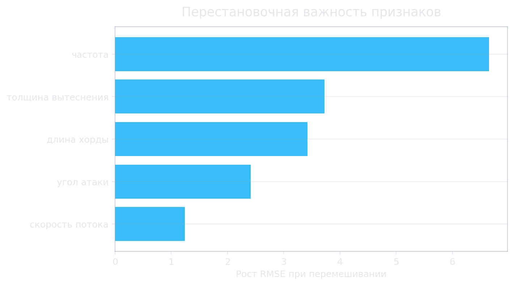

<!-- _class: lead -->

# Прогноз шума аэродинамического профиля

## Итоговый проект машинного обучения

<!--
В проекте решается прикладная задача прогнозирования уровня шума аэродинамического профиля по параметрам эксперимента. Основная цель - получить рабочую модель регрессии и показать полный путь: данные, разведочный анализ, обучение, валидация, интерпретация и сервис для инференса.
-->

---

## 1. Задача

Нужно предсказать уровень звукового давления по пяти физическим признакам:

- частота;
- угол атаки;
- длина хорды;
- скорость потока;
- толщина вытеснения.

Тип задачи: **регрессия**.

<!--
Целевая переменная числовая, поэтому задача формулируется как регрессия. Практический смысл модели - быстро оценивать ожидаемый шум для набора параметров до дополнительных физических испытаний и сравнивать варианты профиля между собой.
-->

---

## 2. Данные

Источник: **UCI Airfoil Self-Noise**.

Набор данных:

- 1503 строки;
- 5 входных признаков;
- 1 целевая переменная;
- без пропусков и дублей.



<!--
Данные локально сохранены в `data.csv`, поэтому ноутбук воспроизводится без внешней загрузки. Все признаки числовые, категориальных переменных нет. Первичная проверка показала, что пропуски и дубли отсутствуют, поэтому агрессивная очистка не потребовалась.
-->

---

## 3. Разведочный анализ

Проверено:

- описательные статистики;
- распределения признаков и целевой переменной;
- boxplot для редких значений;
- корреляционная матрица.

**Вывод:** линейных зависимостей недостаточно, уместны нелинейные модели.

<!--
Разведочный анализ показал разные масштабы признаков и дискретные группы значений, что ожидаемо для экспериментального набора данных. Значения за пределами межквартильного диапазона не удалялись автоматически, потому что они похожи на допустимые экспериментальные режимы, а не на ошибки ввода.
-->

---

## 4. Создание признаков

Добавлены производные признаки:

- отношение частоты к скорости;
- произведение угла и хорды;
- произведение скорости и хорды;
- логарифм частоты.

RMSE улучшился: **1.81 → 1.68**.



<!--
Производные признаки добавлены для учета простых физических взаимодействий между исходными параметрами. В финальной версии они не остаются отдельным ручным шагом: подготовка признаков включена в сохранённый пайплайн, поэтому одинаково применяется при обучении и во Flask-сервисе.
-->

---

## 5. Валидация

Схема проверки:

| Часть | Строк |
| --- | ---: |
| обучение | 901 |
| валидация | 301 |
| тест | 301 |

Тест используется только для финальной оценки.

<!--
В обновленной версии тестовая выборка не участвует в выборе модели. Модели сравниваются по кросс-валидации на обучающей части и дополнительно контролируются на валидации. После выбора финальная модель переобучается на обучении и валидации, а тест используется один раз в конце.
-->

---

## 6. Модели

Проверены:

- константная базовая модель;
- дерево решений;
- KNN-регрессия;
- пайплайн с `RandomForestRegressor`.

Подбор параметров: **GridSearchCV**.



<!--
Базовые модели нужны как нижняя точка сравнения: они показывают, насколько финальная модель лучше простого константного прогноза и простых алгоритмов. Лучший результат дала связка создания признаков и `RandomForestRegressor` внутри пайплайна.
-->

---

## 7. Финальная модель

Финальный артефакт:

```text
sklearn-пайплайн(
  создание признаков,
  RandomForestRegressor
)
```

Лучшие параметры:

- `max_depth=20`;
- `min_samples_leaf=1`;
- `n_estimators=500`.

<!--
Пайплайн сохраняется в `data/random_forest_model.pkl`. Это важная инженерная часть: сервис теперь загружает не только модель, но и весь шаг подготовки признаков, поэтому обучение и инференс используют одну и ту же логику.
-->

---

## 8. Метрики

Финальная оценка на тестовой выборке:

| Метрика | Значение |
| --- | ---: |
| MAE | 1.265 |
| MSE | 2.826 |
| RMSE | 1.681 |
| R2 | 0.944 |



<!--
Основная метрика для интерпретации ошибки - RMSE, потому что она выражена в единицах целевой переменной и сильнее штрафует крупные промахи. R2 около 0.94 показывает, что модель объясняет большую часть разброса целевой переменной на отложенной тестовой выборке.
-->

---

## 9. Интерпретация

Использовано:

- важность признаков модели;
- перестановочная важность;
- топ-5 ошибок.

Наиболее важные исходные признаки:

- частота;
- толщина вытеснения;
- длина хорды.



<!--
Встроенная важность случайного леса показывает вклад уже расширенного набора признаков, а перестановочная важность проверяет влияние исходных входов на тестовой выборке. Анализ пяти крупнейших ошибок нужен, чтобы увидеть режимы, где прогноз менее устойчив и требуется дополнительная проверка.
-->

---

## 10. Инференс

Реализован Flask-сервис:

- `POST /api/inference`;
- HTML-форма для ручной проверки;
- загрузка сохранённого пайплайна;
- вход: признаки.

<!--
Сервис принимает JSON с пятью исходными признаками. Пользователю не нужно самостоятельно считать производные признаки: это делает сохраненный пайплайн. Маршрут `/api/inference` проверен локально и возвращает числовой прогноз.
-->

---

## 11. Ограничения

Модель применима:

- для предварительной оценки;
- внутри диапазонов исходного набора данных;
- с последующей экспериментальной проверкой.

Не заменяет физический эксперимент.

<!--
Главный риск - перенос модели за пределы исходных экспериментальных условий. Для промышленного применения нужен независимый тест на данных целевого стенда или производства, контроль входных диапазонов и периодическое дообучение при накоплении новых измерений.
-->

---

## 12. Итог

В проекте выполнено:

- разведочный анализ и подготовка данных;
- базовая модель и сравнение моделей;
- GridSearchCV и кросс-валидация;
- финальный sklearn-пайплайн;
- Flask-сервис для инференса.

<!--
Итоговый результат - воспроизводимый проект машинного обучения с локальными данными, сохраненным пайплайном и рабочим сервисом. Качество модели лучше базовых подходов, а инженерная часть позволяет использовать модель без повторного обучения при каждом запуске сервиса.
-->
